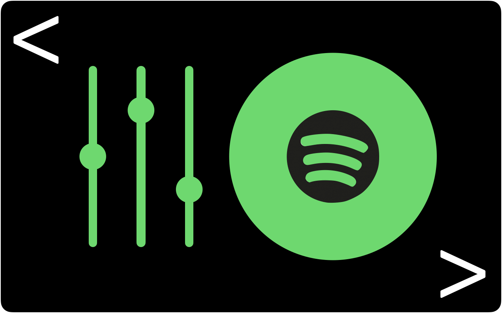

<h1 align="center"> SortSpotify </h1>
<p align="center">  </p>

Command-line tool for managing Spotify playlists, including filtering and sorting playlists by track tempo and key.

## Features

- Create new playlists or filter existing playlists by track tempo (BPM) and key (Camelot values)
- Sort playlists in ascending or descending order by track tempo (BPM)
- Save playlist data as a spreadsheet (.csv file)

## Requirements

- Python3
- [Spotipy](https://spotipy.readthedocs.io/en/2.18.0/)

## Installation

- Clone the repository
  ```
  git clone https://github.com/matthewtwarren/SortSpotify.git
  ```
- Install the requirements
  ```
  cd SortSpotify
  pip install -r requirements.txt
  ```
## Setup

- Head over to [Spotify for Developers](https://developer.spotify.com/dashboard/applications) and create an app
- Open the app dashboard and find the Client ID and Client Secret
- In the app settings, add `https://localhost:8080` to your Redirect URIs
- Open `config.txt` and add your Spotify username, Client ID and Client Secret

## Usage

SortSpotify can be used as a command line tool

- Open your terminal, navigate to the `SortSpotify` directory and run:

```
python -m src.run
```

If it's your first time running the code, you will need to authenticate the app and give it permission to access your Spotify data. An internet browser tab should open automatically to do this.
- Once started, commands can be executed by entering the name of a command. A list of commands can be found by typing `HELP`

```
SDJ> create playlist
```
```
SDJ> sort playlist
```

Please also note: playlists are not automatically added to your Spotify library when they are created using this tool. To add a playlist to your library, run:
```
SDJ> add to spotify
```

### Examples

- Below is an example demonstrating how to create a playlist, add tracks to the playlist, filter the playlist to only contain tracks with BPM between 115 and 125, before then adding the playlist to your Spotify library
```
Welcome to SortSpotify: A command-line interface for managing and creating Spotify playlists.
Type HELP for list of available commands or EXIT to terminate.

SDJ> create playlist
Enter a name for your playlist: House 110-120 BPM
Playlist House/Disco 110-120 BPM created.

SDJ> add to playlist

Your Spotify playlists:

   1  Discover Weekly
   2  Release Radar
   3  House
   4  Disco
   5  Jazz
   6  Soul
   7  Hip Hop
   8  Garage
   9  Techno
  10  Alternative

Enter the number(s) of the playlists to be added (e.g. 0,1,3) or ALL: 3,4
Tracks from House added to House/Disco 115-125 BPM
Tracks from Disco added to House/Disco 115-125 BPM

SDJ> filter playlist
How would you like to filter the playlist (by tempo or key)?: tempo
Please enter a BPM range (e.g. 110:120): 115:125
Tracks filtered by tempo. Playlist now contains 202 tracks.

SDJ> add to spotify
Playlist added to your Spotify library.

SDJ> exit
SortSpotify has terminated.
```
